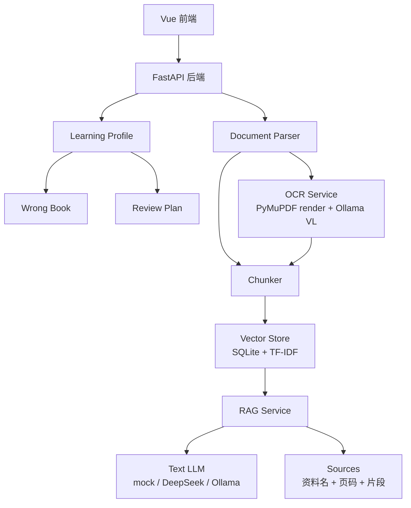

# StudyMate：基于 RAG 与学习画像的个性化课程复习诊断系统

StudyMate 面向大学生课程复习场景，不只做“上传资料后问答”，而是在 RAG 文档问答基础上加入知识点抽取、掌握度评估、错题归因和自适应复习推荐，形成“资料上传 -> 知识点建模 -> 智能问答 -> 练习测评 -> 错因分析 -> 复习规划”的学习闭环。

学生上传 PDF、PPT、Word 或 TXT 后，系统解析文本、切分片段、建立课程知识库，并自动识别课程知识点。后续提问、做题和错题记录会持续更新个人学习画像，诊断薄弱知识点，并根据考试时间生成复习任务；扫描版 PDF 可单独调用本地视觉模型做 OCR。

当前版本是单用户本地演示版，默认用户为 `demo-user`。登录页只是演示入口，学习画像、错题记录、复习任务都绑定这个默认用户；如果要做多用户版本，再增加真实登录、用户表和课程/画像权限隔离。

## 功能亮点

1. 课程资料入库：支持 PDF、PPTX、DOCX、TXT；普通 PDF 直接提取文字层，扫描版 PDF 可走 OCR 入库。
2. RAG 问答：先检索课程片段，再调用文本模型生成回答，并展示资料名、页码和片段来源。
3. Provider 可追踪：前端显示后端实际使用的 provider，例如 `mock/offline`、`deepseek/deepseek-v4-flash`、`ollama/qwen3-vl:30b`。
4. 知识点建模：规则抽取兜底；正式 LLM 模式下尝试 JSON 知识点抽取，再落库到学习画像。
5. 错题闭环：记录题目、用户答案、参考答案、错因分析和关联知识点，反向更新掌握度。
6. 学习画像：展示总体掌握度、薄弱知识点 Top 5、错题归因、知识图谱和复习建议。
7. 复习规划：根据考试日期、每日复习时长和薄弱点生成倒计时复习任务。
8. 展示友好：默认 `mock` 模式无 API 也能跑通上传、检索、引用、画像和计划流程。

## 系统截图

| 首页学习仪表盘 | 课程工作台 |
| --- | --- |
|  |  |

| 问答来源追踪 | 学习画像 |
| --- | --- |
|  |  |

| 复习计划 |
| --- |
|  |

## 技术架构

- 前端：Vue 3 + Vite + Element Plus + ECharts
- 后端：FastAPI + SQLAlchemy
- 数据库：SQLite，本地 demo 通过 `create_all` 自动建表，后续升级已接入 Alembic 迁移目录
- 文档解析：`pypdf` / `PyMuPDF`、`python-pptx`、`python-docx`
- 检索：本地 TF-IDF 稀疏向量检索，后续可替换为 Chroma + Embedding
- 文本大模型：mock 离线演示 / DeepSeek API / OpenAI-compatible API / 本地 Ollama
- OCR：普通 PDF 优先提取文字层；扫描 PDF 可调用本地 Ollama `qwen3-vl:30b`



## 核心流程

```text
上传课程资料
    ↓
解析 PDF/PPT/Word/TXT 文本
    ↓
按页码或幻灯片切分 chunk
    ↓
生成本地稀疏向量权重
    ↓
写入课程知识库
    ↓
抽取知识点并绑定来源页码
    ↓
用户提问
    ↓
检索相关片段
    ↓
调用文本大模型或 mock 离线回答
    ↓
返回答案 + 来源页码
    ↓
学生做题并记录结果
    ↓
更新知识点掌握度与错题本
    ↓
生成个性化复习路径
```

## 本地运行

后端：

```powershell
cd D:\sunny\studymate\backend
python -m venv .venv
.\.venv\Scripts\python.exe -m pip install -r requirements.txt
.\.venv\Scripts\python.exe -m uvicorn app.main:app --reload --host 127.0.0.1 --port 8000
```

前端：

```powershell
cd D:\sunny\studymate\frontend
npm.cmd install
npm.cmd run dev
```

后端默认读取 `backend/.env`，可从 `backend/.env.example` 复制：

```env
TEXT_LLM_PROVIDER=mock
TEXT_LLM_MODEL=
TEXT_LLM_BASE_URL=
TEXT_LLM_API_KEY=

TEXT_LLM_FALLBACK_PROVIDER=none
TEXT_LLM_FALLBACK_MODEL=
TEXT_LLM_FALLBACK_BASE_URL=
TEXT_LLM_FALLBACK_API_KEY=

OCR_LLM_PROVIDER=ollama
OCR_LLM_MODEL=qwen3-vl:30b
OCR_LLM_BASE_URL=http://127.0.0.1:11434

OCR_DEFAULT_MAX_PAGES=10
OCR_MAX_PAGES_PER_REQUEST=20
DOCUMENT_UPLOAD_MAX_BYTES=104857600
TXT_UPLOAD_MAX_BYTES=10485760
```

### 文本生成模式

| 模式 | 适合情况 | 关键配置 |
| --- | --- | --- |
| `mock` | 无 API，先跑通上传、检索、引用、学习画像流程 | `TEXT_LLM_PROVIDER=mock` |
| `deepseek` | 正式问答生成、复习提纲和练习题生成 | `TEXT_LLM_PROVIDER=deepseek`，填写 `TEXT_LLM_API_KEY` |
| `ollama` | 本地模型演示，适合没有云端 API 的答辩环境 | `TEXT_LLM_PROVIDER=ollama`，配置 `TEXT_LLM_MODEL` 和 `TEXT_LLM_BASE_URL` |

DeepSeek 示例：

```env
TEXT_LLM_PROVIDER=deepseek
TEXT_LLM_MODEL=deepseek-v4-flash
TEXT_LLM_BASE_URL=https://api.deepseek.com
TEXT_LLM_API_KEY=你的 DeepSeek Key
TEXT_LLM_FALLBACK_PROVIDER=none
```

Ollama 文本模型示例：

```env
TEXT_LLM_PROVIDER=ollama
TEXT_LLM_MODEL=qwen3-vl:30b
TEXT_LLM_BASE_URL=http://127.0.0.1:11434
TEXT_LLM_FALLBACK_PROVIDER=none
```

如果要配置 fallback，可以把 `TEXT_LLM_FALLBACK_PROVIDER` 改成 `ollama` 或其他 OpenAI-compatible 服务；默认关闭 fallback，便于展示时准确判断到底调用了哪个 provider。

### OCR 与上传限制

| 类型 | 限制 / 建议 |
| --- | --- |
| PDF / PPTX / DOCX | 最大 100MB |
| TXT | 最大 10MB |
| OCR 单次页数 | 默认最多 20 页，建议每次 5-10 页 |
| 普通 PDF | 直接上传，系统用 PyMuPDF/pypdf 提取文字层并入库 |
| 扫描 PDF | 点击资料卡片的 OCR 入库，优先用 `fast` 快速索引模式 |
| 少量关键页 | 使用 `full` 精确 OCR，适合公式和细节较多的页面 |
| 低配电脑 | 先用外部 PaddleOCR/Tesseract 或其他工具生成带文本层 PDF，再上传 |

如果使用本地 Ollama 模式，先启动模型：

```powershell
ollama list
ollama run qwen3-vl:30b
```

如果你的文本问答不想使用 DeepSeek，也可以改成其他 OpenAI-compatible 服务：

```env
TEXT_LLM_PROVIDER=openai_compatible
TEXT_LLM_MODEL=your-model
TEXT_LLM_BASE_URL=http://127.0.0.1:1234/v1
TEXT_LLM_API_KEY=
```

### 数据库迁移

本地演示仍保留启动时 `Base.metadata.create_all(bind=engine)`，保证 clone 后能直接运行。正式升级表结构时使用 Alembic：

```powershell
cd D:\sunny\studymate\backend
alembic upgrade head
alembic revision --autogenerate -m "describe schema change"
```

## 演示脚本

1. 打开首页，展示今日待复习、最近提问、最近错题、考试倒计时和本周学习趋势。
2. 打开课程列表，新建或选择一门课程。
3. 上传一份真实课程 PDF/TXT，页面显示资料状态为“已入库”。
4. 提问“虚函数为什么能实现运行时多态？”或“第三章的重点是什么？”
5. 查看回答下方的资料名、页码和来源片段。
6. 点击生成复习提纲。
7. 在练习题区域选择“易错题”和薄弱知识点，生成专项练习。
8. 进入“学习诊断中心”，查看知识点掌握度、薄弱排名、错题归因和知识图谱。
9. 把一道错题写入错题本，查看系统生成的错因和后续训练建议。
10. 填写考试日期、每天复习时长和目标，生成倒计时复习计划。
11. 如果资料上传错了，在资料卡片点击“删除”，系统会同步删除资料、chunk、OCR job 和本地文件。

一键后端 smoke test：

```powershell
cd D:\sunny\studymate
python scripts\smoke_test.py
```

## 项目目录

```text
studymate/
  backend/
    app/
      routers/          FastAPI 路由：课程、资料、问答、学习画像
      services/         RAG、OCR、检索、学习画像和文档解析
      models/           SQLAlchemy 数据模型
      schemas/          Pydantic 请求模型
    migrations/         Alembic 迁移目录
    tests/              后端接口测试
    .env.example        默认 mock 模式配置
  frontend/
    src/
      views/            首页、课程详情、学习诊断等页面
      api/              Axios API 封装和统一错误提示
      theme/            图表主题配置
  docs/
    images/             README 截图
    API.md              接口说明
  scripts/
    smoke_test.py       后端端到端验证脚本
```

## 后续计划

| 阶段 | 方向 | 说明 |
| --- | --- | --- |
| 检索升级 | Chroma + bge-m3 / text-embedding-3-small / qwen embedding | 保持 `search_course()` 返回字段不变，前端和 RAG 层低成本替换 |
| 多用户 | users 表 + 登录态 + 课程权限 | 当前版本固定 `demo-user`，后续绑定真实 user_id |
| OCR 轻量化 | PaddleOCR / Tesseract | 降低 `qwen3-vl:30b` 对普通电脑的要求 |
| 工程化 | Alembic 迁移、CI、前端 lint/test | 当前已加入 pytest、smoke test 和 Alembic 基础目录 |
| 学习分析 | 更细的行为日志和周报 | 让首页趋势从最近记录升级为完整学习事件流 |

## 项目亮点

本项目不是传统的课程资料问答系统，而是面向大学生课程复习场景构建的个性化学习诊断平台。系统在 RAG 文档问答的基础上，引入知识点抽取、错题归因、掌握度评估和自适应复习推荐机制，实现“资料上传—知识点建模—智能问答—练习测评—错因分析—复习规划”的完整学习闭环。

相比普通 PDF 问答系统，StudyMate 不仅能够回答资料中的问题，还能持续记录学生的学习行为和答题结果，动态生成个人知识画像，识别薄弱知识点，并根据考试时间和掌握程度自动推荐复习路径。文本生成和扫描版 PDF OCR 已拆分配置，方便同时使用云端文本 API 和本地视觉模型。
