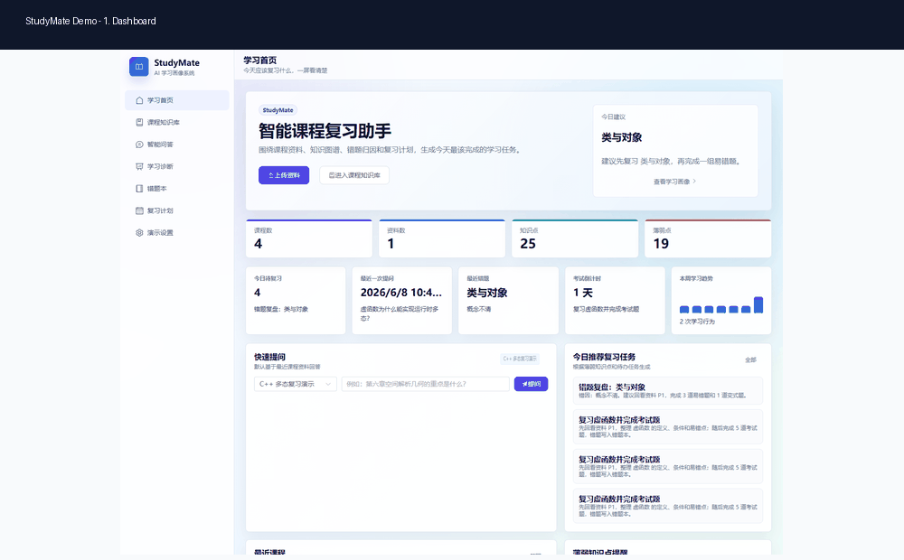
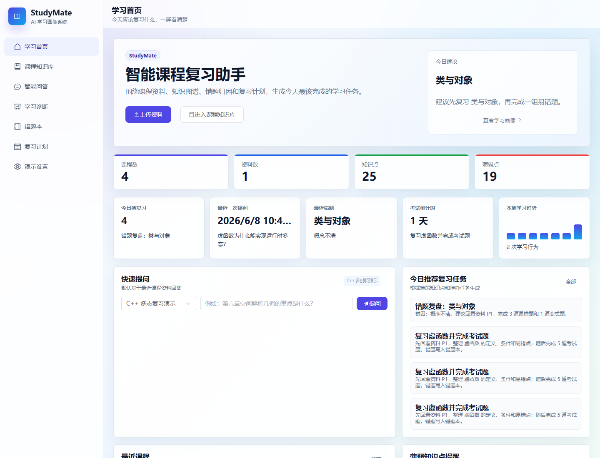
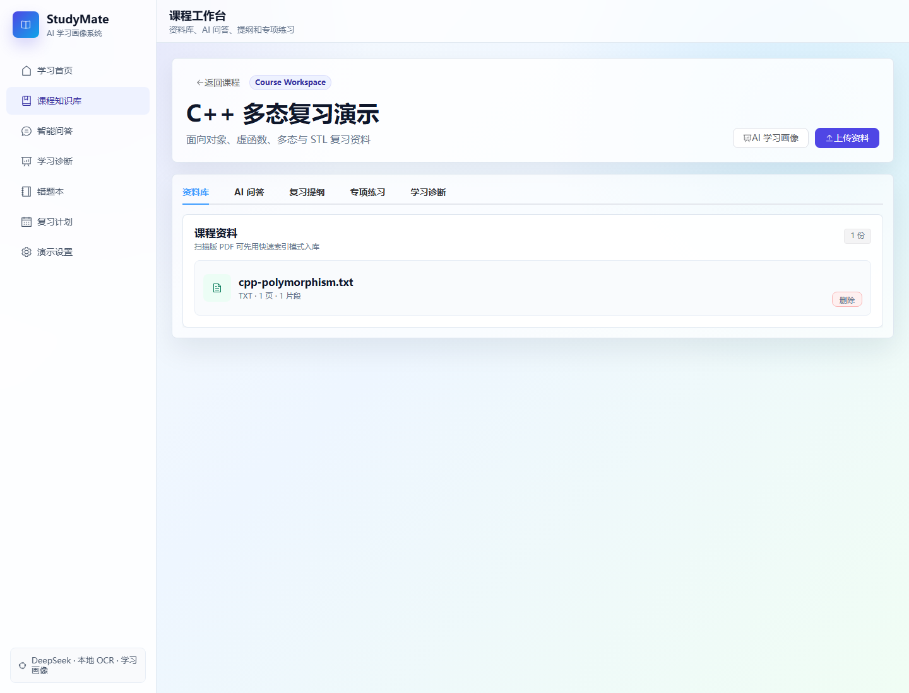
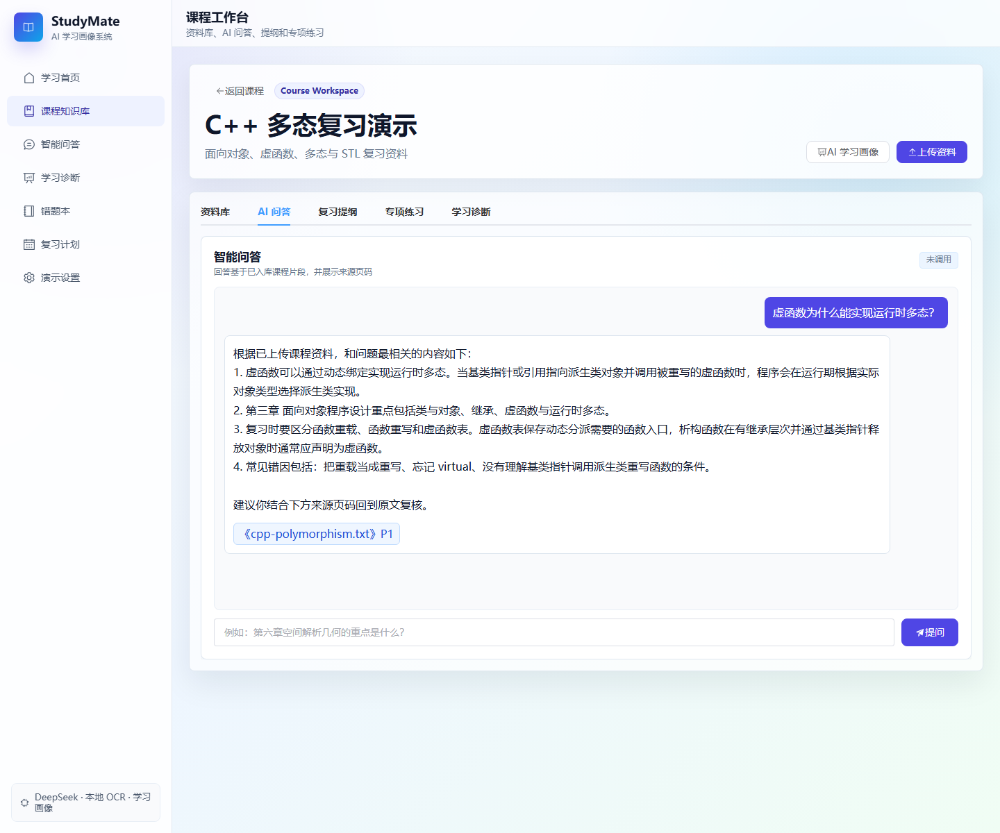
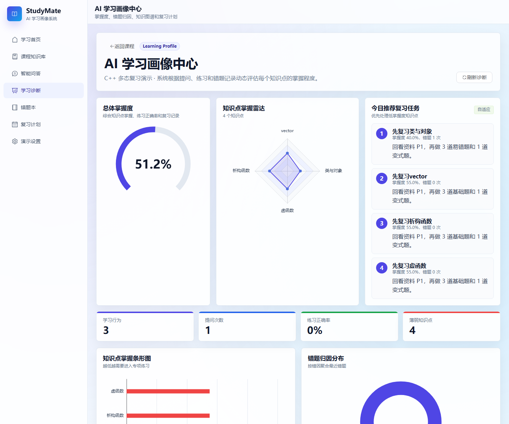
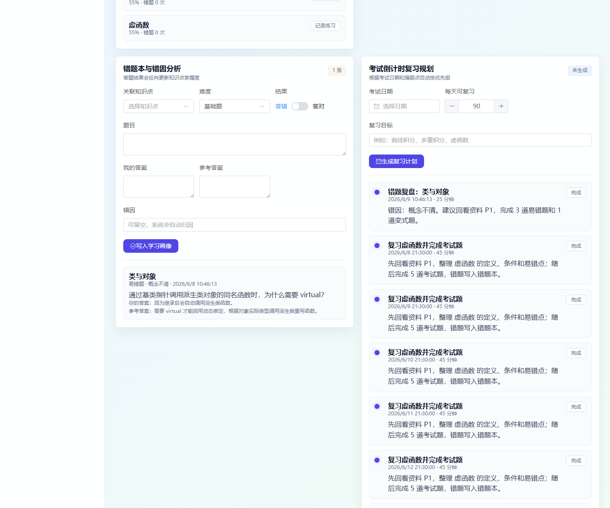
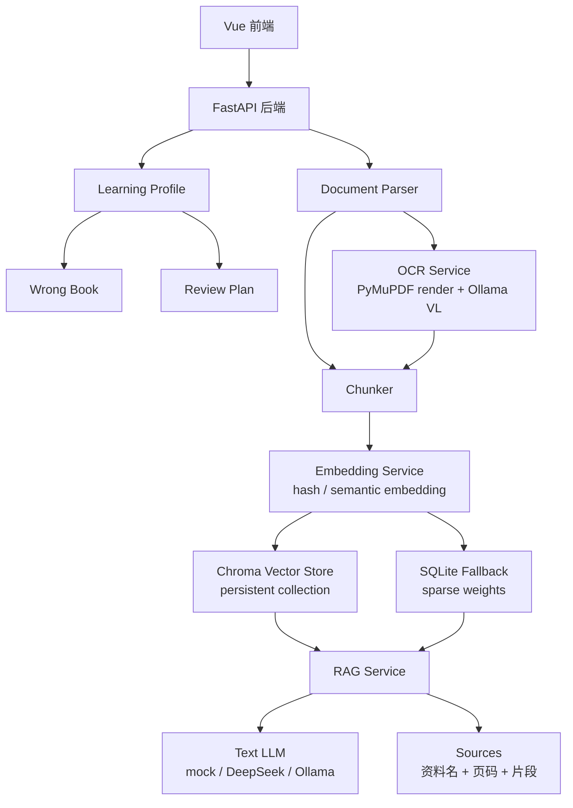

# StudyMate：课程复习诊断原型系统

StudyMate 是面向大学生课程复习场景的课程项目原型。它在“上传资料后问答”的基础上，加入资料入库状态、可配置检索、知识点抽取、掌握度评估、错题归因、复习计划和 PDF 学习报告，形成“资料上传 -> 知识点建模 -> 智能问答 -> 练习测评 -> 错因分析 -> 复习规划 -> 报告导出”的演示闭环。

默认配置不依赖任何 API key：文本生成使用 `mock` 离线模式，embedding 使用轻量 hash 方案，适合 clone 后快速演示。需要更真实的语义检索时，可以把 `EMBEDDING_PROVIDER` 切换为 `sentence_transformers` 或 `openai_compatible`。

当前版本已经加入真实登录系统：后端提供 `users` 表、密码哈希、Bearer token，课程按 `courses.user_id` 绑定用户；课程、资料、问答、错题、复习任务和学习报告接口都会按当前登录用户过滤。默认本地演示账号为 `demo@studymate.local / studymate-demo`。

## 功能亮点

1. 真实登录与数据隔离：注册/登录后课程按当前用户保存，避免不同用户共享课程和学习画像。
2. 课程资料入库：支持 PDF、PPTX、DOCX、TXT；普通 PDF 直接提取文字层，扫描版 PDF 可走 OCR 入库。
3. 可配置 RAG 检索：默认 hash embedding + Chroma；可切换 sentence-transformers 或 OpenAI-compatible embedding；SQLite 稀疏检索始终保留兜底。
4. 后台资料入库：上传接口先返回，后台按 `queued -> parsing -> chunking -> indexing -> syncing_knowledge_points -> indexed/empty/failed/needs_ocr` 推进，前端轮询显示状态。
5. Provider 可追踪：问答结果区分 `retrieval_provider` 和 `llm_provider`，便于答辩说明检索和生成分别用了什么。
6. 学习画像可解释：掌握度公式、错因分类、薄弱等级和解释文本都会返回到前端与 PDF 报告。
7. C++ 助教：本地 `g++` 编译诊断 + 规则考点识别 + LLM/离线解释，未安装 g++ 时友好降级。
8. 学习报告导出：PDF 包含封面、学习总览、薄弱知识点 Top 5、最近错题、复习计划、AI 建议和来源说明。
9. 展示友好：默认 `mock` 模式无 API 也能跑通上传、检索、引用、画像、计划和报告流程。

## 系统截图



| 首页学习仪表盘 | 课程工作台 |
| --- | --- |
|  |  |

| 问答来源追踪 | 学习画像 |
| --- | --- |
|  |  |

| 复习计划 |
| --- |
|  |

## 项目展示数据

- GitHub 展示快照：公开仓库 1 star、0 fork。
- 语言占比：Python 62.0%、Vue 22.3%、CSS 11.3%、JavaScript 3.6%。
- 答辩主线：上传资料 -> Chroma 检索问答 -> 练习诊断 -> PDF 学习报告导出。

## 技术架构

- 前端：Vue 3 + Vite + Element Plus + ECharts
- 后端：FastAPI + SQLAlchemy
- 数据库：SQLite，本地 demo 通过 `create_all` 自动建表，后续升级已接入 Alembic 迁移目录
- 文档解析：`pypdf` / `PyMuPDF`、`python-pptx`、`python-docx`
- 检索：可配置 embedding 服务（默认 hash，可选 sentence-transformers / OpenAI-compatible）+ Chroma，SQLite 稀疏检索作为兜底
- 文本大模型：mock 离线演示 / DeepSeek API / OpenAI-compatible API / 本地 Ollama
- OCR：普通 PDF 优先提取文字层；扫描 PDF 可调用本地 Ollama `qwen3-vl:30b`



## 核心流程

```text
上传课程资料
    ↓
后台解析 PDF/PPT/Word/TXT 文本
    ↓
按页码或幻灯片切分 chunk
    ↓
生成 embedding（默认 hash，可配置语义模型）
    ↓
写入 Chroma 向量库和 SQLite 兜底索引
    ↓
抽取知识点并绑定来源页码
    ↓
用户提问
    ↓
检索相关片段
    ↓
调用文本大模型或 mock 离线回答
    ↓
返回答案 + 来源页码
    ↓
学生做题并记录结果
    ↓
更新知识点掌握度与错题本
    ↓
生成个性化复习路径
```

## 本地运行

后端：

```powershell
cd D:\sunny\studymate\backend
python -m venv .venv
.\.venv\Scripts\python.exe -m pip install -r requirements.txt
.\.venv\Scripts\python.exe -m uvicorn app.main:app --reload --host 127.0.0.1 --port 8000
```

前端：

```powershell
cd D:\sunny\studymate\frontend
npm.cmd install
npm.cmd run dev
```

后端默认读取 `backend/.env`，可从 `backend/.env.example` 复制：

```env
TEXT_LLM_PROVIDER=mock
TEXT_LLM_MODEL=
TEXT_LLM_BASE_URL=
TEXT_LLM_API_KEY=

TEXT_LLM_FALLBACK_PROVIDER=none
TEXT_LLM_FALLBACK_MODEL=
TEXT_LLM_FALLBACK_BASE_URL=
TEXT_LLM_FALLBACK_API_KEY=

OCR_LLM_PROVIDER=ollama
OCR_LLM_MODEL=qwen3-vl:30b
OCR_LLM_BASE_URL=http://127.0.0.1:11434

OCR_DEFAULT_MAX_PAGES=10
OCR_MAX_PAGES_PER_REQUEST=20
DOCUMENT_UPLOAD_MAX_BYTES=104857600
TXT_UPLOAD_MAX_BYTES=10485760

AUTH_SECRET_KEY=studymate-dev-secret-change-me
AUTH_TOKEN_EXPIRE_MINUTES=10080
DEMO_USER_EMAIL=demo@studymate.local
DEMO_USER_PASSWORD=studymate-demo
CHROMA_DIR=storage/chroma
EMBEDDING_PROVIDER=hash
EMBEDDING_MODEL=BAAI/bge-small-zh-v1.5
EMBEDDING_BASE_URL=
EMBEDDING_API_KEY=
EMBEDDING_DIMENSION=384
EMBEDDING_BATCH_SIZE=16
APP_ENV=development
```

### 检索与 Embedding 配置

默认 `EMBEDDING_PROVIDER=hash` 是轻量演示方案：它把 token hash 到固定维度向量，适合无模型、无 API 的本地演示，但不等同于真正语义 embedding。

如果要展示真实语义检索，可以选择：

```env
EMBEDDING_PROVIDER=sentence_transformers
EMBEDDING_MODEL=BAAI/bge-small-zh-v1.5
EMBEDDING_DIMENSION=384
```

本地需要额外安装 `sentence-transformers` 并准备模型。若依赖缺失或模型加载失败，系统会自动降级到 hash，并在 `retrieval_provider` 中显示 fallback 原因。

OpenAI-compatible embedding 示例：

```env
EMBEDDING_PROVIDER=openai_compatible
EMBEDDING_MODEL=text-embedding-3-small
EMBEDDING_BASE_URL=https://api.openai.com/v1
EMBEDDING_API_KEY=你的 Key
```

无论 Chroma 或语义 embedding 是否可用，SQLite 稀疏检索兜底都会保留。

### 后台解析状态

资料上传接口只保存文件并创建 `Document` 记录，随后后台任务依次进入：

```text
queued -> parsing -> chunking -> indexing -> syncing_knowledge_points -> indexed / empty / failed / needs_ocr
```

前端资料库会轮询这些状态。大文件上传时页面不会一直卡在上传请求里；解析失败会显示后端返回的明确错误信息。

### 学习画像掌握度公式

每个知识点初始掌握度为 60 分。练习记录按难度和正误调整：

| 情况 | 分值变化 |
| --- | ---: |
| 答对基础题 | +5 |
| 答对提高题 | +8 |
| 答对考试题 | +10 |
| 答错基础题 | -8 |
| 答错提高题 | -12 |
| 答错考试题 | -15 |
| 易错题答错 | -15 |

时间权重：最近 7 天记录权重 1.2，7 到 30 天权重 1.0，30 天前权重 0.6。最终分数限制在 0 到 100。

薄弱等级：

| 分数 | 等级 |
| --- | --- |
| 0-40 | 高危薄弱 |
| 40-60 | 需要复习 |
| 60-80 | 基本掌握 |
| 80-100 | 掌握良好 |

错因分类包括 `concept_confusion`、`formula_error`、`procedure_gap`、`coding_syntax`、`careless`、`unknown`。学习画像和 PDF 报告会输出“为什么系统认为你薄弱”的解释文本。

### C++ 编译诊断

C++ 助教现在由三部分组成：

1. 本地 `g++ main.cpp -std=c++17 -Wall -Wextra -O0 -o main` 编译诊断。
2. 规则考点识别：类与对象、继承、虚函数、友元、运算符重载、模板、STL、指针引用等。
3. LLM 解释或离线解释：说明编译错误、考点、修改建议和同类训练题。

如果本机没有安装 `g++`，后端会返回“未检测到 g++”的友好提示，不影响规则分析和离线解释。

### 安全配置

本地 demo 可以使用默认 `AUTH_SECRET_KEY=studymate-dev-secret-change-me`。如果设置 `APP_ENV=production` 且仍使用默认密钥，后端会拒绝启动。正式部署必须修改密钥，不要把真实 API key 写入仓库。

### 文本生成模式

| 模式 | 适合情况 | 关键配置 |
| --- | --- | --- |
| `mock` | 无 API，先跑通上传、检索、引用、学习画像流程 | `TEXT_LLM_PROVIDER=mock` |
| `deepseek` | 正式问答生成、复习提纲和练习题生成 | `TEXT_LLM_PROVIDER=deepseek`，填写 `TEXT_LLM_API_KEY` |
| `ollama` | 本地模型演示，适合没有云端 API 的答辩环境 | `TEXT_LLM_PROVIDER=ollama`，配置 `TEXT_LLM_MODEL` 和 `TEXT_LLM_BASE_URL` |

DeepSeek 示例：

```env
TEXT_LLM_PROVIDER=deepseek
TEXT_LLM_MODEL=deepseek-v4-flash
TEXT_LLM_BASE_URL=https://api.deepseek.com
TEXT_LLM_API_KEY=你的 DeepSeek Key
TEXT_LLM_FALLBACK_PROVIDER=none
```

Ollama 文本模型示例：

```env
TEXT_LLM_PROVIDER=ollama
TEXT_LLM_MODEL=qwen3-vl:30b
TEXT_LLM_BASE_URL=http://127.0.0.1:11434
TEXT_LLM_FALLBACK_PROVIDER=none
```

如果要配置 fallback，可以把 `TEXT_LLM_FALLBACK_PROVIDER` 改成 `ollama` 或其他 OpenAI-compatible 服务；默认关闭 fallback，便于展示时准确判断到底调用了哪个 provider。

### OCR 与上传限制

| 类型 | 限制 / 建议 |
| --- | --- |
| PDF / PPTX / DOCX | 最大 100MB |
| TXT | 最大 10MB |
| OCR 单次页数 | 默认最多 20 页，建议每次 5-10 页 |
| 普通 PDF | 直接上传，系统用 PyMuPDF/pypdf 提取文字层并入库 |
| 扫描 PDF | 点击资料卡片的 OCR 入库，优先用 `fast` 快速索引模式 |
| 少量关键页 | 使用 `full` 精确 OCR，适合公式和细节较多的页面 |
| 低配电脑 | 先用外部 PaddleOCR/Tesseract 或其他工具生成带文本层 PDF，再上传 |

如果使用本地 Ollama 模式，先启动模型：

```powershell
ollama list
ollama run qwen3-vl:30b
```

如果你的文本问答不想使用 DeepSeek，也可以改成其他 OpenAI-compatible 服务：

```env
TEXT_LLM_PROVIDER=openai_compatible
TEXT_LLM_MODEL=your-model
TEXT_LLM_BASE_URL=http://127.0.0.1:1234/v1
TEXT_LLM_API_KEY=
```

### 数据库迁移

本地演示仍保留启动时 `Base.metadata.create_all(bind=engine)`，保证 clone 后能直接运行。正式升级表结构时使用 Alembic：

```powershell
cd D:\sunny\studymate\backend
alembic upgrade head
alembic revision --autogenerate -m "describe schema change"
```

## 演示脚本

1. 使用 `demo@studymate.local / studymate-demo` 登录，确认顶部显示当前账号。
2. 打开“报告亮点”页，选择一门课程，展示“上传资料 -> 提问 -> 做题 -> 出报告”的答辩路径。
3. 打开课程列表，新建或选择一门课程。
4. 上传一份真实课程 PDF/TXT，观察状态从“已上传，等待解析”推进到“已入库”。
5. 提问“虚函数为什么能实现运行时多态？”或“第三章的重点是什么？”
6. 查看回答下方的资料名、页码、`retrieval_provider` 和 `llm_provider`。
7. 点击生成复习提纲。
8. 在练习题区域选择“易错题”和薄弱知识点，生成专项练习。
9. 打开 C++ 代码页，粘贴一段有语法错误的代码，展示本地编译诊断和规则考点识别。
10. 进入“学习诊断中心”，查看知识点掌握度、薄弱排名、错题归因和知识图谱。
11. 把一道错题写入错题本，查看系统生成的掌握度解释和后续训练建议。
12. 填写考试日期、每天复习时长和目标，生成倒计时复习计划。
13. 在“报告亮点”或“学习诊断中心”点击导出 PDF 报告。

一键后端 smoke test：

```powershell
cd D:\sunny\studymate
python scripts\smoke_test.py
```

后端回归测试：

```powershell
cd D:\sunny\studymate
python -m pytest backend\tests -q
```

前端构建验证：

```powershell
cd D:\sunny\studymate\frontend
npm.cmd install
npm.cmd run build
```

## 项目目录

```text
studymate/
  backend/
    app/
      routers/          FastAPI 路由：认证、课程、资料、问答、学习画像
      services/         认证、RAG、OCR、检索、学习画像和文档解析
      models/           SQLAlchemy 数据模型
      schemas/          Pydantic 请求模型
    migrations/         Alembic 迁移目录
    tests/              后端接口测试
    .env.example        默认 mock 模式配置
  frontend/
    src/
      views/            首页、课程详情、学习诊断、报告亮点等页面
      api/              Axios API 封装和统一错误提示
      theme/            图表主题配置
  docs/
    images/             README 截图和演示 GIF
    API.md              接口说明
  scripts/
    smoke_test.py       后端端到端验证脚本
```

## 当前限制与后续计划

当前限制：

- 默认 SQLite 适合本地演示，不适合高并发生产环境。
- 默认 hash embedding 只适合轻量演示；答辩时应说明它不是深度语义模型。
- OCR 依赖本地视觉模型或外部 OCR 工具，低配电脑建议先生成带文本层 PDF。
- C++ 编译诊断依赖本机 `g++`，未安装时只能展示规则分析和离线解释。
- 学习画像是基于规则和行为记录的轻量模型，后续可引入更复杂的认知诊断模型。

| 阶段 | 方向 | 说明 |
| --- | --- | --- |
| 检索增强 | bge-m3 / text-embedding-3-small / qwen embedding | 当前使用离线 hash embedding，后续可替换为更强语义模型 |
| 权限增强 | 课程分享、班级空间、角色权限 | 当前已按登录用户隔离，后续可扩展协作场景 |
| OCR 轻量化 | PaddleOCR / Tesseract | 降低 `qwen3-vl:30b` 对普通电脑的要求 |
| 工程化 | CI、前端 lint/test、迁移回放 | 当前已加入 pytest、smoke test 和 Alembic 迁移 |
| 学习分析 | 更细的行为日志和周报 | 让首页趋势从最近记录升级为完整学习事件流 |

## 项目亮点

本项目不是传统的课程资料问答 demo，而是面向大学生课程复习场景构建的学习诊断原型系统。系统在 RAG 文档问答的基础上，引入知识点抽取、错题归因、掌握度评估和基于规则的复习推荐，实现“资料上传—知识点建模—智能问答—练习测评—错因分析—复习规划”的可演示闭环。

相比普通 PDF 问答系统，StudyMate 额外记录学生的学习行为和答题结果，生成轻量学习画像，识别薄弱知识点，并根据考试时间和掌握程度生成复习任务。文本生成、embedding 和扫描版 PDF OCR 已拆分配置，方便在无 API 的本地演示与真实模型演示之间切换。
## 本地验收结果

* python -m pytest backend/tests -q：passed
* cd frontend && npm run build：passed
* python scripts/smoke_test.py：passed
